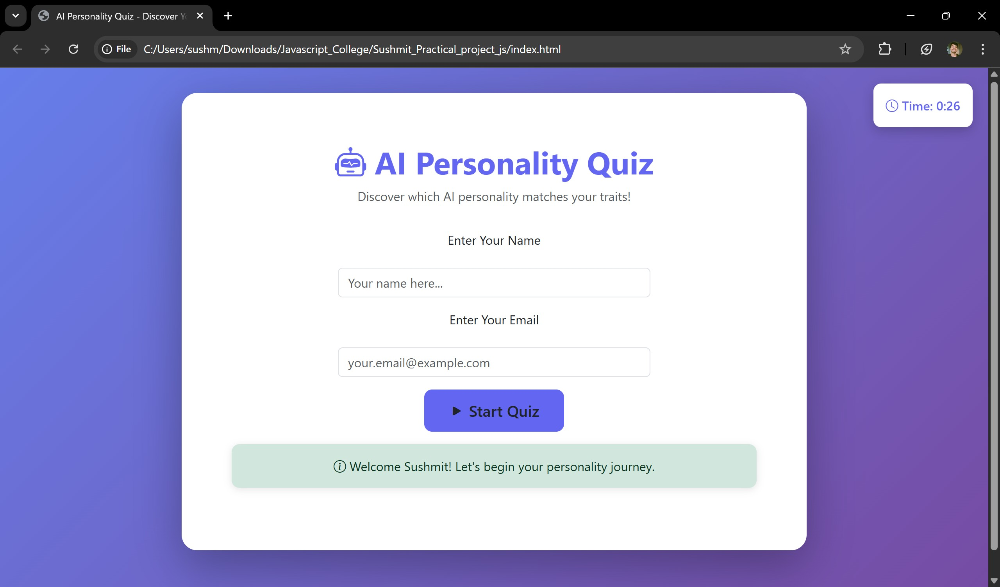
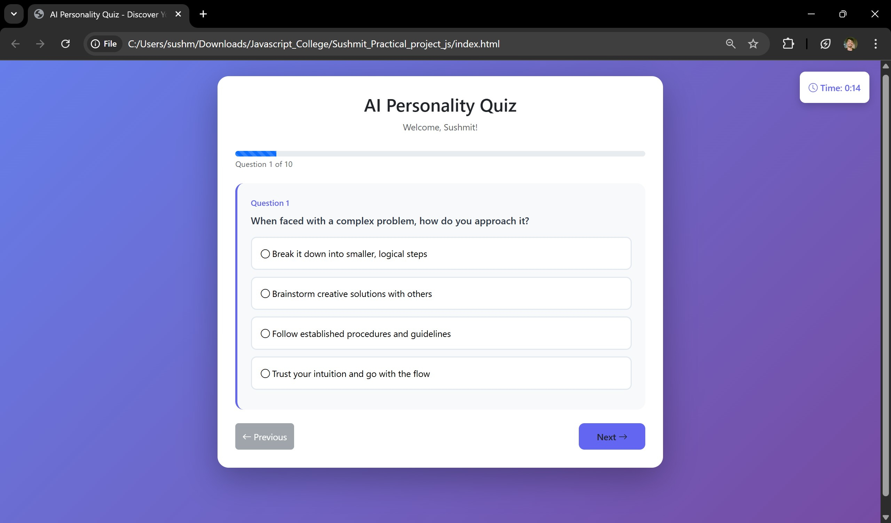
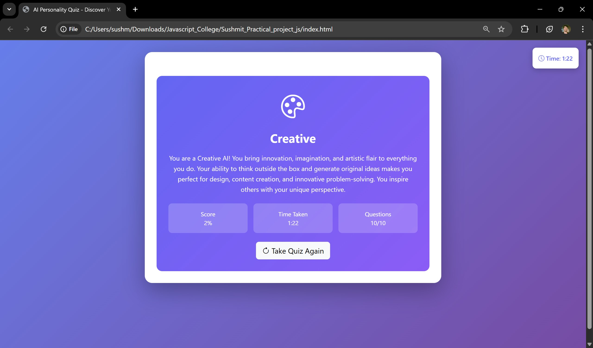

# AI Personality Quiz Website

A professional, interactive AI Personality Quiz website built with HTML, CSS, and JavaScript. This project demonstrates comprehensive JavaScript concepts including ES6+ features, DOM manipulation, form validation, web storage, and more.

## 🎯 Project Overview

This quiz helps users discover their AI personality type by answering 10 carefully crafted questions. The website features a modern, responsive design using Bootstrap 5 and includes all functionality in a single `index.html` file.

### 📸 Website Screenshots

**Screenshot 1: Welcome Screen**

*Welcome screen with user registration form*

**Screenshot 2: Quiz Interface**

*Interactive quiz with progress bar and question display*

**Screenshot 3: Results Page**

*Personality results with statistics and description*

## 🚀 Features

- **Interactive Quiz Interface**: 10 personality-based questions with multiple choice answers
- **Real-time Progress Tracking**: Visual progress bar and question counter
- **Timer Functionality**: Tracks time taken to complete the quiz
- **Form Validation**: Real-time validation for name and email inputs
- **Results Display**: Beautiful results page showing personality type, description, and statistics
- **Data Persistence**: Uses localStorage and sessionStorage to save user preferences and results
- **Responsive Design**: Works seamlessly on desktop, tablet, and mobile devices
- **Professional UI**: Modern gradient design with smooth animations

## 📁 File Structure

```
Sushmit_Practical_project_js/
│
├── index.html          # Single file containing all HTML, CSS, and JavaScript
└── README.md          # Project documentation
```

## 🛠️ Technologies Used

### Frontend Framework & Libraries
- **Bootstrap 5.3.0**: CSS framework for responsive design and UI components
- **Bootstrap Icons 1.11.0**: Icon library for visual elements

### JavaScript Concepts Demonstrated

#### 1. **JavaScript Setup and Developer Tools**
   - ✅ Inline JavaScript (onclick attributes in HTML)
   - ✅ Internal JavaScript (script tags in HTML)
   - ✅ External JavaScript (demonstrated with embedded data structure)
   - ✅ Console methods:
     - `console.log()` - General logging
     - `console.error()` - Error logging
     - `console.table()` - Tabular data display
     - `console.trace()` - Stack trace logging
   - ✅ User environment info logging

#### 2. **Variables, Data Types & ES6+ Features**
   - ✅ Variable declarations: `var`, `let`, `const`
   - ✅ Template literals (backticks and ${})
   - ✅ Destructuring (objects and arrays)
   - ✅ Default parameters in functions
   - ✅ Spread operator (`...`)
   - ✅ Arrow functions

#### 3. **Conditionals, Loops & User Input**
   - ✅ `if-else` statements
   - ✅ `switch-case` statements
   - ✅ `for` loops
   - ✅ `while` loops (implicit in setInterval)
   - ✅ `forEach()` loops
   - ✅ Form input handling
   - ✅ Input validation

#### 4. **Functions, Scope & Error Handling**
   - ✅ Function declarations
   - ✅ Function expressions
   - ✅ Arrow functions
   - ✅ Function scope and block scope
   - ✅ Closures
   - ✅ `try-catch` blocks for error handling
   - ✅ Error logging and fallback values

#### 5. **Arrays & Objects with Higher-Order Functions**
   - ✅ Array methods:
     - `push()` - Adding elements
     - `map()` - Transforming arrays
     - `filter()` - Filtering arrays
     - `reduce()` - Reducing arrays to single value
     - `forEach()` - Iterating over arrays
   - ✅ Object arrays handling
   - ✅ Nested object structures

#### 6. **String Methods & Regular Expressions**
   - ✅ String methods:
     - `split()` - Splitting strings
     - `match()` - Pattern matching
     - `replace()` - String replacement
     - `indexOf()` - Finding positions
     - `trim()`, `toLowerCase()`, `toUpperCase()`
     - `charAt()`, `slice()`
   - ✅ Regular expressions for:
     - Email validation
     - Name validation
     - Vowel counting
   - ✅ String manipulation and processing

#### 7. **DOM Traversal and Manipulation**
   - ✅ `getElementById()` - Element selection
   - ✅ `querySelector()` - Advanced selection
   - ✅ `createElement()` - Dynamic element creation
   - ✅ `appendChild()` - Adding elements
   - ✅ `innerHTML` - Content manipulation
   - ✅ `textContent` - Text updates
   - ✅ `classList` manipulation (add, remove)
   - ✅ Dynamic UI updates

#### 8. **Form Handling & Validation**
   - ✅ Form element access
   - ✅ Event listeners:
     - `onsubmit` - Form submission
     - `onblur` - Field blur events
     - `onchange` - Value change events
   - ✅ Real-time validation
   - ✅ Input sanitization
   - ✅ Error message display
   - ✅ Form state management

#### 9. **Web Storage and State Management**
   - ✅ `localStorage` - Persistent storage
     - Saving user preferences
     - Storing quiz results
     - Loading saved data
   - ✅ `sessionStorage` - Session-based storage
     - Tracking quiz session state
   - ✅ JSON serialization/deserialization
   - ✅ State persistence across page reloads

#### 10. **JSON Handling and Mini API Mock**
   - ✅ JSON data structure (quizData object)
   - ✅ JSON parsing with `JSON.parse()`
   - ✅ JSON stringification with `JSON.stringify()`
   - ✅ Simulated API calls using `setTimeout()`
   - ✅ Promise-based data loading
   - ✅ Async/await patterns
   - ✅ Dynamic data display

#### 11. **Timers and Dynamic UI**
   - ✅ `setInterval()` - Recurring timer for quiz clock
   - ✅ `setTimeout()` - Delayed execution
     - Quiz start alerts
     - Auto-dismissing notifications
   - ✅ Timer management (start, stop, update)
   - ✅ Dynamic UI updates based on time

## 🎨 Design Features

- **Modern Gradient Background**: Purple gradient theme
- **Card-based Layout**: Clean, organized sections
- **Smooth Animations**: Fade-in effects and transitions
- **Progress Indicators**: Visual progress bar
- **Responsive Grid**: Stats grid that adapts to screen size
- **Icon Integration**: Bootstrap Icons throughout
- **Color-coded Sections**: Different colors for different states

## 📊 Personality Types

The quiz determines one of four AI personality types:

1. **Analytical** 🧮 - Logical, data-driven, detail-oriented
2. **Creative** 🎨 - Innovative, imaginative, artistic
3. **Systematic** 📊 - Organized, reliable, structured
4. **Intuitive** ❤️ - Empathetic, adaptive, people-oriented

## 🚀 How to Use

1. **Open the Website**: Simply open `index.html` in any modern web browser
2. **Enter Information**: Fill in your name and email on the welcome screen
3. **Take the Quiz**: Answer all 10 questions by selecting your preferred option
4. **View Results**: See your AI personality type, description, and statistics
5. **Retake Quiz**: Click "Take Quiz Again" to restart

## 💾 Data Storage

- **User Information**: Stored in `localStorage` for returning users
- **Quiz Results**: Last 10 quiz results saved in `localStorage`
- **Session State**: Current quiz session tracked in `sessionStorage`

## 🔍 Browser Compatibility

- Chrome (latest)
- Firefox (latest)
- Safari (latest)
- Edge (latest)
- Opera (latest)

## 📝 Code Organization

The code is organized into clear sections:
- Quiz data structure
- JavaScript concepts (11 main sections)
- DOM manipulation functions
- Event handlers
- Utility functions

## 🎓 Learning Outcomes

This project demonstrates:
- Complete JavaScript fundamentals
- Modern ES6+ syntax
- DOM manipulation techniques
- Form validation best practices
- Web storage API usage
- Timer and async operations
- Error handling patterns
- Code organization and structure

## 📄 License

This project is created for educational purposes as part of a JavaScript practical project.

## 👨‍💻 Author

Created as part of JavaScript College Practical Project demonstrating comprehensive JavaScript concepts.

---

**Note**: All code is contained in a single `index.html` file for easy deployment and demonstration purposes.

