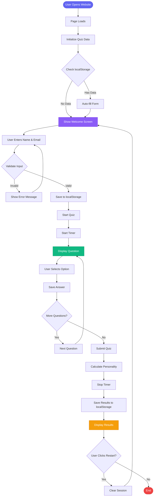
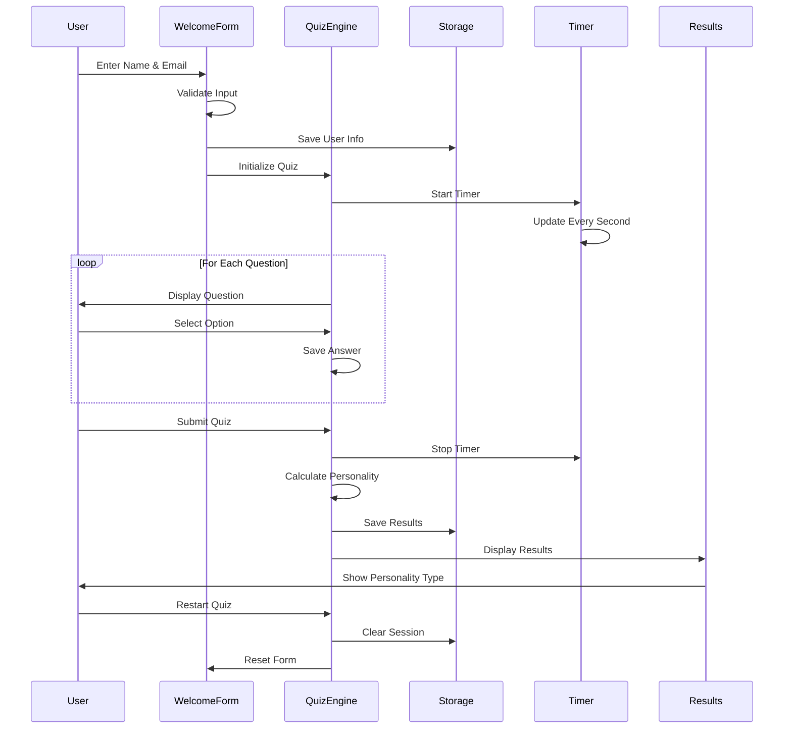
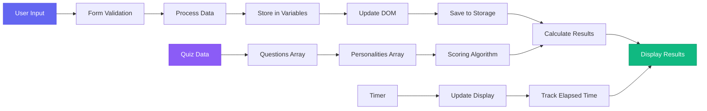

# Website Structure Diagram

## Mermaid Diagram

```mermaid
graph TD
    A[index.html - Single File Application] --> B[HTML Structure]
    A --> C[CSS Styles]
    A --> D[JavaScript Code]
    
    B --> B1[Welcome Section]
    B --> B2[Quiz Section]
    B --> B3[Results Section]
    B --> B4[Timer Display]
    
    B1 --> B1a[Name Input]
    B1 --> B1b[Email Input]
    B1 --> B1c[Start Button]
    
    B2 --> B2a[Progress Bar]
    B2 --> B2b[Question Container]
    B2 --> B2c[Option Buttons]
    B2 --> B2d[Navigation Buttons]
    
    B3 --> B3a[Personality Icon]
    B3 --> B3b[Personality Name]
    B3 --> B3c[Description]
    B3 --> B3d[Statistics Grid]
    B3 --> B3e[Restart Button]
    
    C --> C1[Bootstrap 5.3.0]
    C --> C2[Custom CSS]
    C --> C3[Bootstrap Icons]
    
    C2 --> C2a[Color Variables]
    C2 --> C2b[Responsive Design]
    C2 --> C2c[Animations]
    C2 --> C2d[Card Styles]
    
    D --> D1[Quiz Data]
    D --> D2[Core Functions]
    D --> D3[Event Handlers]
    D --> D4[Storage Management]
    
    D1 --> D1a[Questions Array]
    D1 --> D1b[Personalities Array]
    
    D2 --> D2a[initializeQuiz]
    D2 --> D2b[displayQuestion]
    D2 --> D2c[selectOption]
    D2 --> D2d[calculatePersonality]
    D2 --> D2e[submitQuiz]
    D2 --> D2f[restartQuiz]
    
    D3 --> D3a[Form Validation]
    D3 --> D3b[Input Events]
    D3 --> D3c[Button Clicks]
    D3 --> D3d[Timer Events]
    
    D4 --> D4a[localStorage]
    D4 --> D4b[sessionStorage]
    D4 --> D4c[JSON Handling]
    
    style A fill:#6366f1,stroke:#4f46e5,color:#fff
    style B fill:#8b5cf6,stroke:#7c3aed,color:#fff
    style C fill:#10b981,stroke:#059669,color:#fff
    style D fill:#f59e0b,stroke:#d97706,color:#fff
```



## Application Flow Diagram



## JavaScript Concepts Implementation Map

```mermaid
mindmap
  root((AI Personality Quiz))
    JavaScript Setup
      Inline JS
      Internal JS
      External JS
      Console Methods
    Variables & ES6+
      var, let, const
      Template Literals
      Destructuring
      Default Parameters
      Spread Operator
    Conditionals & Loops
      if-else
      switch-case
      for loops
      forEach
      while loops
    Functions & Scope
      Function Declarations
      Arrow Functions
      Closures
      Error Handling
    Arrays & Objects
      map()
      filter()
      reduce()
      forEach()
      Object Arrays
    Strings & Regex
      String Methods
      Email Validation
      Pattern Matching
      Text Processing
    DOM Manipulation
      getElementById
      querySelector
      createElement
      innerHTML
      classList
    Form Handling
      Event Listeners
      Real-time Validation
      Input Sanitization
      Error Messages
    Web Storage
      localStorage
      sessionStorage
      JSON Handling
      State Management
    JSON & API Mock
      JSON Structure
      setTimeout
      Promises
      Async/Await
    Timers
      setInterval
      setTimeout
      Timer Management
      Dynamic Updates
```

## Component Interaction Diagram



## Data Flow Diagram



